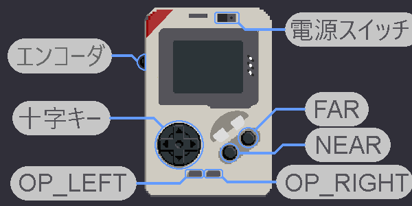
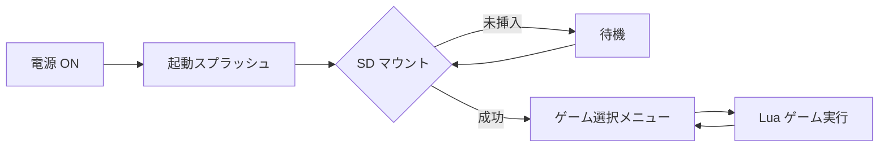
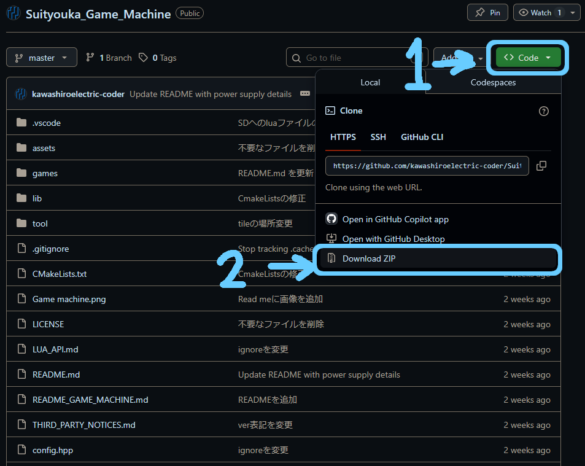
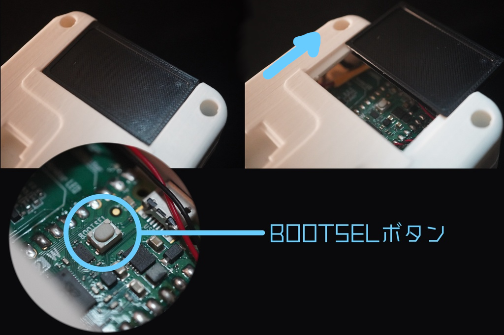

# Suityouka Game Machine



**Raspberry Pi Pico 2W** 向けの携帯ゲーム機ファームウェアです。  
SD カード上の **Lua 5.4** ゲームを起動し、320×240 LCD・8 ボタン・I2S 音声で遊べます。  
電源は単三電池2本となります。

MIT License · Copyright (c) 2026 [Kawashiro Electric](https://github.com/kawashiroelectric-coder)

---

## 特徴

| カテゴリ | 内容 |
|----------|------|
| **画面** | ST7789 320×240 RGB565、バンド描画 + DMA |
| **入力** | 8 ボタン（I2C IO エキスパンダ）+ ロータリーエンコーダ（音量） |
| **音声** | PCM5102 I2S、BGM ストリーム + SE 最大 8 系統（44.1 kHz） |
| **ストレージ** | SPI SD / FatFS（FAT32・exFAT、SDXC 対応） |
| **ゲーム** | Lua `game_init` / `game_update` / `game_draw`、タイルレイヤー、UTF-8 フォント |
| **UI** | ゲーム選択メニュー、システム設定、SD ホットプラグ |

---

## 起動の流れ



- SD 未挿入でも起動（挿入後に自動でゲーム一覧を読み込み）
- ゲーム終了後は **ゲーム選択メニュー** に戻る
- **LEFT** ボタンで **システム設定**（輝度・音量・Input Test 等）

---

## クイックスタート

### 1. リポジトリのダウンロード（ZIP）

GitHub 上の本リポジトリから、次の手順で **ZIP をダウンロード**して **解凍**してください。以降の「ファーム書き込み」「SD カード準備」は、解凍してできたフォルダ内のファイルを使います。



1. リポジトリページ右上の緑の **Code** ボタンをクリックします。
2. メニュー下部の **Download ZIP** をクリックして ZIP を保存します。
3. ダウンロードした ZIP を解凍し、展開先フォルダを作業場所にします。

> **Clone ではなく ZIP でよい場合**: 上記の手順だけで十分です。Git で clone する場合は `git clone` でもかまいません（その場合も同じフォルダ構成になります）。

### 2. ファームウェア書き込み

同梱のビルド済み `.uf2` を書き込めば、**ビルドなしですぐ遊べます**。  
Pico 2W は **BOOTSEL モード**（USB マスストレージとして PC に見える状態）にすると、`.uf2` をドラッグ＆ドロップするだけで書き込めます。

> **使うファイル（推奨）**: 解凍したフォルダ内の [`VerUpFile/Suityouka_Game_Machine.uf2`](VerUpFile/Suityouka_Game_Machine.uf2)  
> 自分でビルドしたファームを使う場合のみ、後述の「ビルド（必要な人だけ）」で生成した `build/Suityouka_Game_Machine.uf2` を代わりに使ってください。

#### 手順

1. **本体の電源を切り**、Pico 2W を USB ケーブルで PC に接続する準備をします（まだ挿さない）。
2. 基板上の **BOOTSEL ボタン**の位置を確認します（下図の丸で囲んだボタン）。

   

3. **BOOTSEL ボタンを押したまま**、USB ケーブルを PC に接続します。
4. ボタンを押し続けたまま接続が完了したら、**ボタンを離します**。
5. PC に **`RP2350`（または `RPI-RP2`）** という名前のリムーバブルドライブが表示されます。これが BOOTSEL モードの目印です。
   - 表示されない場合は、いったんケーブルを抜き、手順 3 からやり直してください（ボタンを最後まで押し続けるのがコツです）。
6. [`VerUpFile/Suityouka_Game_Machine.uf2`](VerUpFile/Suityouka_Game_Machine.uf2) を、その **ドライブへドラッグ＆ドロップ**（コピー）します。
7. コピーが終わると Pico が**自動的に再起動**し、ドライブは自動で消えます。これで書き込み完了です。
8. 起動画面が表示されれば成功です。表示されない場合は USB ケーブル（給電のみのケーブルではなくデータ通信対応のもの）を確認してください。

> **更新（バージョンアップ）のとき**も手順は同じです。BOOTSEL モードにして新しい `VerUpFile/Suityouka_Game_Machine.uf2` を上書きコピーするだけで、SD カードの内容やセーブデータはそのまま保持されます。

### 3. SD カード

1. **FAT32** または **exFAT** でフォーマット（SDXC 推奨: exFAT）
2. ルートに **`games`** フォルダを作成
3. サンプルをコピー（解凍したフォルダの [`games/`](games/) → SD の `/games/`）

```
SD:/
└── games/
    ├── stg/stg.lua
    ├── sokoban/sokoban.lua
    ├── Shogi/Shogi.lua
    ├── Run!Yamame/Run!Yamame.lua
    └── visual_novel/visual_novel.lua
```

4. SD を挿入 → メニューからゲームを選択 → **NEAR** で起動

詳細な SD ルール（起動スクリプトの決め方・プレビュー `.bin`）は [LUA_API.md](LUA_API.md) を参照してください。

### 4. ビルド（必要な人だけ）

通常の起動・更新では **この手順は不要**です。ソースを改変したファームを自分で書き込みたいときにだけ行ってください。

[Raspberry Pi Pico SDK](https://github.com/raspberrypi/pico-sdk)（Pico VS Code 拡張可）を用意し:

```bash
mkdir build && cd build
cmake ..
cmake --build .
```

生成物は `build/Suityouka_Game_Machine.uf2` です。書き込み方は手順 2 と同じで、コピーするファイルをこちらに差し替えてください。

デバッグ用 FPS / RAM オーバーレイ:

```bash
cmake -DGAME_MACHINE_DEBUG=ON ..
cmake --build .
```

---

## 付属サンプルゲーム

[`games/`](games/) に Lua サンプルが同梱されています。SD では `games/` をトップに配置します。

`games/(ゲームフォルダ)/(起動用.lua)`

| フォルダ | ジャンル |
|----------|----------|
| [stg](games/stg/) | 縦スクロール STG「翠晶撃線」 |
| [stg_fast](games/stg_fast/) | STG（描画最適化版） |
| [Shogi](games/Shogi/) | 将棋 vs もみじ（難易度 3 段階・セーブ対応） |
| [Run!Yamame](games/Run!Yamame/) | 洞窟ランナー（ジャンプ／スライド／白い球・HI SCORE） |
| [visual_novel](games/visual_novel/) | ビジュアルノベル |
| [tile_test](games/tile_test/) | タイル横スクロール |
| [sokoban](games/sokoban/) | 倉庫番（ランダム生成） |
| [save_test](games/save_test/) | セーブ API テスト |

各ゲームの README に必要アセット・操作説明があります。一覧の詳細は [games/README.md](games/README.md) を参照してください。

---

## Lua でゲームを作る

最小構成:

```lua
function game_init()
    -- 初期化（1 回）
end

function game_update(dt)
    -- 毎フレーム。true で終了
    return false
end

function game_draw()
    -- 描画（1 フレームあたり複数回呼ばれる）
end
```

- **API 一覧:** [LUA_API.md](LUA_API.md)
- **PC プレビュー:** [tool/lua_preview/](tool/lua_preview/)（pygame）
- **画像変換:** [tool/README.md](tool/README.md)（PNG → RGB565 `.bin`）

---

## リポジトリ構成

| パス | 説明 |
|------|------|
| `game_machine_main.cpp` | エントリポイント |
| `config.hpp` | GPIO・画面・ヒープ等の設定 |
| `lib/` | 自前ドライバ・Lua ランタイム・UI（[lib/README.md](lib/README.md)） |
| `lib/no-OS-FatFS-SD-SDIO-SPI-RPi-Pico/` | SD/FatFS（vendored、[改変記録](lib/no-OS-FatFS-SD-SDIO-SPI-RPi-Pico/MODIFICATIONS.md)） |
| `games/` | サンプル Lua ゲーム（[games/README.md](games/README.md)） |
| `VerUpFile/` | 配布用ビルド済み `.uf2` |
| `tool/` | 画像・音声・プレビュー用 Python ツール |
| `assets/` | 起動ロゴ・効果音等（C ヘッダー生成元） |

---

## ハードウェア（概要）

| 部品 | 接続 |
|------|------|
| MCU | Raspberry Pi **Pico 2W** |
| LCD | ST7789 320×240（SPI0） |
| SD | SPI1 |
| ボタン | PCA9539（I2C） |
| 音声 | PCM5102（I2S 44.1 kHz） |
| エンコーダ | クアッド A/B + SW |

ピン配置の詳細・オシロスコープ目安・バッテリー ADC は [README_GAME_MACHINE.md](README_GAME_MACHINE.md#ハードウェア構成) を参照してください。  
ボードを変える場合は **`config.hpp` の `CFG_*` のみ**編集する設計です。

---

## ドキュメント

| ドキュメント | 内容 |
|--------------|------|
| [README_GAME_MACHINE.md](README_GAME_MACHINE.md) | 詳細仕様・ビルド・ハードウェア |
| [LUA_API.md](LUA_API.md) | Lua `machine.*` API・SD 配置 |
| [games/README.md](games/README.md) | サンプルゲーム一覧 |
| [lib/README.md](lib/README.md) | ライブラリ構成 |
| [tool/README.md](tool/README.md) | アセット変換ツール |

---

## ライセンス

- **本リポジトリのオリジナルコード:** [LICENSE](LICENSE)（MIT License）
- **サードパーティ:** [THIRD_PARTY_NOTICES.md](THIRD_PARTY_NOTICES.md)  
  （Pico SDK、Lua、no-OS-FatFS / FatFs 等）

---

## 謝辞

- [carlk3/no-OS-FatFS-SD-SDIO-SPI-RPi-Pico](https://github.com/carlk3/no-OS-FatFS-SD-SDIO-SPI-RPi-Pico)（Apache-2.0、改変あり）
- [Raspberry Pi Pico SDK](https://github.com/raspberrypi/pico-sdk)
- [Lua](https://www.lua.org/)
