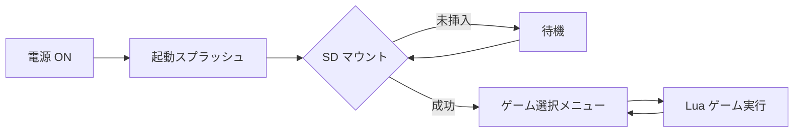

# Suityouka Game Machine

**Raspberry Pi Pico 2W** 向けの携帯ゲーム機ファームウェアです。  
SD カード上の **Lua 5.4** ゲームを起動し、320×240 LCD・8 ボタン・I2S 音声で遊べます。

MIT License · Copyright (c) 2026 [Kawashiro Electric](https://github.com/kawashiroelectric-coder)

---

## 特徴

| カテゴリ | 内容 |
|----------|------|
| **画面** | ST7789 320×240 RGB565、バンド描画 + DMA |
| **入力** | 8 ボタン（I2C IO エキスパンダ）+ ロータリーエンコーダ（音量） |
| **音声** | PCM5102 I2S、BGM ストリーム + SE 最大 8 系統（44.1 kHz） |
| **ストレージ** | SPI SD / FatFS（FAT32・exFAT、SDXC 対応） |
| **ゲーム** | Lua `game_init` / `game_update` / `game_draw`、タイルレイヤー、UTF-8 フォント |
| **UI** | ゲーム選択メニュー、システム設定、SD ホットプラグ |

---

## 起動の流れ



- SD 未挿入でも起動（挿入後に自動でゲーム一覧を読み込み）
- ゲーム終了後は **ゲーム選択メニュー** に戻る
- **LEFT** ボタンで **システム設定**（輝度・音量・Input Test 等）

---

## クイックスタート

### 1. ビルド

[Raspberry Pi Pico SDK](https://github.com/raspberrypi/pico-sdk)（Pico VS Code 拡張可）を用意し:

```bash
mkdir build && cd build
cmake ..
cmake --build .
```

デバッグ用 FPS / RAM オーバーレイ:

```bash
cmake -DGAME_MACHINE_DEBUG=ON ..
cmake --build .
```

### 2. ファームウェア書き込み

`build/Suityouka_Game_Machine.uf2` を BOOTSEL 状態の **Pico 2W** にコピーします。

### 3. SD カード

1. **FAT32** または **exFAT** でフォーマット（SDXC 推奨: exFAT）
2. ルートに **`games`** フォルダを作成
3. サンプルをコピー（リポジトリの [`games/`](games/) → SD の `/games/`）

```
SD:/
└── games/
    ├── stg/stg.lua
    ├── sokoban/sokoban.lua
    ├── stack_blocks/stack_blocks.lua
    └── visual_novel/visual_novel.lua
```

4. SD を挿入 → メニューからゲームを選択 → **NEAR** で起動

詳細な SD ルール（起動スクリプトの決め方・プレビュー `.bin`）は [LUA_API.md](LUA_API.md) を参照してください。

---

## 付属サンプルゲーム

[`games/`](games/) に Lua サンプルが同梱されています。SD ではgamesをトップに配置します。

games/(ここにゲームのファイル)/(ここにゲームのlua)

| フォルダ | ジャンル |
|----------|----------|
| [stg](Game/stg/) | 縦スクロール STG「翠晶撃線」 |
| [stg_fast](Game/stg_fast/) | STG（描画最適化版） |
| [visual_novel](Game/visual_novel/) | ビジュアルノベル |
| [tile_test](Game/tile_test/) | タイル横スクロール |
| [sokoban](Game/sokoban/) | 倉庫番（ランダム生成） |
| [bad_apple](Game/bad_apple/) | 1bit 動画再生デモ |
| [save_test](Game/save_test/) | セーブ API テスト |

各ゲームの README に必要アセット・操作説明があります。

---

## Lua でゲームを作る

最小構成:

```lua
function game_init()
    -- 初期化（1 回）
end

function game_update(dt)
    -- 毎フレーム。true で終了
    return false
end

function game_draw()
    -- 描画（1 フレームあたり複数回呼ばれる）
end
```

- **API 一覧:** [LUA_API.md](LUA_API.md)
- **PC プレビュー:** [tool/lua_preview/](tool/lua_preview/)（pygame）
- **画像変換:** [tool/README.md](tool/README.md)（PNG → RGB565 `.bin`）

---

## リポジトリ構成

| パス | 説明 |
|------|------|
| `game_machine_main.cpp` | エントリポイント |
| `config.hpp` | GPIO・画面・ヒープ等の設定 |
| `lib/` | 自前ドライバ・Lua ランタイム・UI（[lib/README.md](lib/README.md)） |
| `lib/no-OS-FatFS-SD-SDIO-SPI-RPi-Pico/` | SD/FatFS（vendored、[改変記録](lib/no-OS-FatFS-SD-SDIO-SPI-RPi-Pico/MODIFICATIONS.md)） |
| `Game/` | サンプル Lua ゲーム |
| `tool/` | 画像・音声・プレビュー用 Python ツール |
| `assets/` | 起動ロゴ・効果音等（C ヘッダー生成元） |

---

## ハードウェア（概要）

| 部品 | 接続 |
|------|------|
| MCU | Raspberry Pi **Pico 2W** |
| LCD | ST7789 320×240（SPI0） |
| SD | SPI1 |
| ボタン | PCA9539（I2C） |
| 音声 | PCM5102（I2S 44.1 kHz） |
| エンコーダ | クアッド A/B + SW |

ピン配置の詳細・オシロスコープ目安・バッテリー ADC は [README_GAME_MACHINE.md](README_GAME_MACHINE.md#ハードウェア構成) を参照してください。  
ボードを変える場合は **`config.hpp` の `CFG_*` のみ**編集する設計です。

---

## ドキュメント

| ドキュメント | 内容 |
|--------------|------|
| [README_GAME_MACHINE.md](README_GAME_MACHINE.md) | 詳細仕様・ビルド・ハードウェア |
| [LUA_API.md](LUA_API.md) | Lua `machine.*` API・SD 配置 |
| [Game/README.md](Game/README.md) | サンプルゲーム一覧 |
| [lib/README.md](lib/README.md) | ライブラリ構成 |
| [tool/README.md](tool/README.md) | アセット変換ツール |

---

## ライセンス

- **本リポジトリのオリジナルコード:** [LICENSE](LICENSE)（MIT License）
- **サードパーティ:** [THIRD_PARTY_NOTICES.md](THIRD_PARTY_NOTICES.md)  
  （Pico SDK、Lua、no-OS-FatFS / FatFs 等）

---

## 謝辞

- [carlk3/no-OS-FatFS-SD-SDIO-SPI-RPi-Pico](https://github.com/carlk3/no-OS-FatFS-SD-SDIO-SPI-RPi-Pico)（Apache-2.0、改変あり）
- [Raspberry Pi Pico SDK](https://github.com/raspberrypi/pico-sdk)
- [Lua](https://www.lua.org/)
