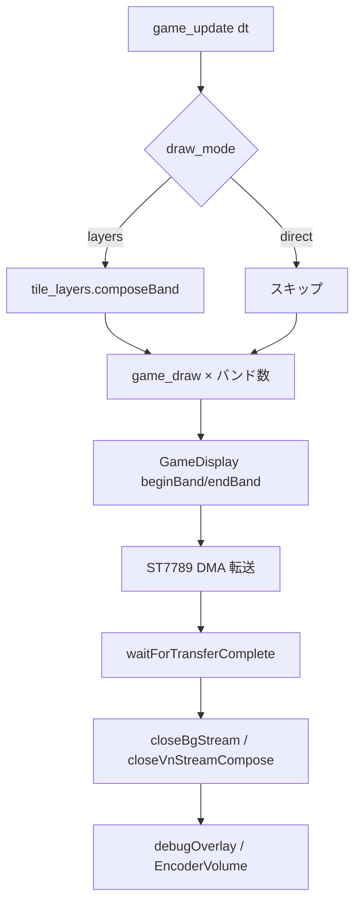

# lib/ ライブラリ構成

Pico 2W ゲーム機ファームウェアの **`lib/` 配下**（自前コード）の役割と依存関係のまとめです。  
ピン配置・画面サイズ・ヒープ予算はルートの [`config.hpp`](../config.hpp) を参照してください。

---

## 全体像

```
game_machine_main.cpp          … 起動・初期化・メインループ
        │
        ├── input_test_mode    … SD 未マウント時の入力テスト
        ├── game_catalog       … /games ゲーム検出
        ├── game_select_menu   … ゲーム選択 GUI
        ├── system_settings_menu … システム設定 GUI
        ├── file_explorer      … SD 上 .lua 選択 GUI（レガシー）
        │         └── lua_interpreter … Lua ゲーム実行 (machine.*)
        │                   ├── game_display … バンド描画 → ST7789
        │                   ├── tile_layers  … layers モード背景
        │                   ├── font_renderer / vn_stream / bg_stream
        │                   ├── lua_audio → audio_output → pcm5102_i2s
        │                   └── heap_budget (Lua malloc 予算)
        ├── sd_service         … FatFS マウント
        │         └── sd_card_hw + no-OS-FatFS (サードパーティ)
        ├── button_input       … I2C ボタン + バッテリー LED
        ├── encoder_volume     … 音量 (encoder_input 利用)
        └── battery_monitor    … ADC 残量 → button_input LED
```

### 1 フレームの描画フロー（Lua ゲーム）

`LuaInterpreter::runGameLoopFromSd` がホスト側ループを担当します。



- **`game_draw` は 1 フレームあたり `bandCount()` 回**呼ばれます（バンド高さ = `GameConfig::BUFFER_HEIGHT`、通常 20 行）。
- Lua からの描画はすべて **`GameDisplay`** 経由（`machine.*` → `lua_api_draw.cpp`）。
- 大きな背景・VN 立ち絵は **`draw_bg_stream` / `draw_vn_stream`** で SD から帯ごと読み込み（`bg_stream_util`）。

---

## ライブラリ一覧

| ディレクトリ | 役割 | 主な公開 API | 依存先（自前） |
|-------------|------|-------------|----------------|
| [`ST7789/`](ST7789/) | ST7789 LCD 低レベル（SPI・DMA 転送） | `ST7789_LCD` | `config.hpp` |
| [`game_display/`](game_display/) | RGB565 バンド FB・クリッピング描画 | `GameDisplay` | ST7789, FontRenderer |
| [`font_renderer/`](font_renderer/) | MISF 美咲 UTF-8 フォント | `FontRenderer` | FatFS（SD 読込） |
| [`tile_layers/`](tile_layers/) | GBA 風タイル背景（最大 4 層） | `TileLayerSystem` | GameDisplay |
| [`button_input/`](button_input/) | PCA9539 ボタン + バッテリー LED | `ButtonInput` | I2C |
| [`encoder_input/`](encoder_input/) | クアッドエンコーダ | `EncoderInput` | GPIO IRQ |
| [`encoder_volume/`](encoder_volume/) | 15 段階マスター音量 UI | `EncoderVolumeControl` | encoder_input, AudioOutput, LuaAudio |
| [`input_test_mode/`](input_test_mode/) | SD 待ち入力テスト画面 | `InputTestMode::run` | ST7789, ButtonInput |
| [`game_catalog/`](game_catalog/) | `/games` エントリ検出・プレビュー | `GameCatalog::*` | FatFS, config |
| [`game_select_menu/`](game_select_menu/) | ゲーム選択メニュー | `GameSelectMenu::run` | game_catalog, system_settings_menu, ST7789 |
| [`system_settings_menu/`](system_settings_menu/) | システム設定画面 | `SystemSettingsMenu::run` | ST7789, ButtonInput |
| [`file_explorer/`](file_explorer/) | SD ファイル一覧・`.lua` 実行 | `FileExplorer::run` | ST7789, ButtonInput |
| [`sd_service/`](sd_service/) | FatFS マウント管理 | `SdService` | sd_card_hw, FatFS |
| [`sd_card_hw/`](sd_card_hw/) | SPI ピン・`hw_config`・SD 診断 | `hw_config.c`, `sd_debug.*` | Pico SDK |
| [`sd_path_util/`](sd_path_util/) | SD パス正規化（ヘッダのみ） | `resolveSdPath` 等 inline | なし |
| [`heap_budget/`](heap_budget/) | 動的ヒープ予算 | `HeapBudget::*` | なし |
| [`pcm5102_i2s/`](pcm5102_i2s/) | I2S PIO プログラム | `.pio` | Pico SDK |
| [`audio_output/`](audio_output/) | Core1 I2S 再生・DMA | `AudioOutput` | pcm5102_i2s |
| [`lua_interpreter/`](lua_interpreter/) | Lua 5.4 + `machine.*` | `LuaInterpreter` | 上記ほぼすべて |
| [`battery_monitor/`](battery_monitor/) | Core1 ADC 監視 | `BatteryMonitor` | button_input |

> **`no-OS-FatFS-SD-SDIO-SPI-RPi-Pico/`** は vendored サードパーティです。  
> upstream からの **改変内容** は [`no-OS-FatFS-SD-SDIO-SPI-RPi-Pico/MODIFICATIONS.md`](no-OS-FatFS-SD-SDIO-SPI-RPi-Pico/MODIFICATIONS.md) を参照してください。

---

## 各ライブラリ詳細

### `game_machine_main.cpp`（lib 外だが起点）

- フレームバッファ 2 枚（`framebuffer_a/b`）を確保し `GameDisplay::bind`。
- `LuaHostHooks` でボタン・描画を `LuaInterpreter` に接続。
- SD 有無で **入力テスト ↔ ゲーム選択メニュー** を切り替え。

### `ST7789/`

- **SPI0** で LCD と通信。`GameDisplay::endBand` から DMA 転送をキック。
- ファイルエクスプローラ・入力テストは **`ST7789_LCD` を直接**使う（バンド FB なし）。

### `game_display/`

- 論理画面 320×240 を **高さ 20 の横帯（バンド）** に分割して描画。
- `beginBand` / `endBand` / `waitForTransferComplete` が Lua ループと対になる。
- `drawImageSub` / `drawImageSubKeyed` は VN ストリーム合成からも利用。

### `lua_interpreter/`（中核）

| ファイル | 役割 |
|---------|------|
| `lua_interpreter.cpp` | ゲームループ、`load_image`、BG ストリーム、SD 読込 |
| `lua_api_machine.cpp` | `machine` テーブル登録、パス API、音声・描画の橋渡し |
| `lua_api_draw.cpp` | 描画・バンド・画像・`draw_vn_stream` の Lua バインディング |
| `lua_api_audio.cpp` | `play_wav` / `play_se` / `play_tone` |
| `lua_api_internal.cpp` | アクティブ interpreter / display、色パース |
| `lua_audio.cpp` | BGM ストリーム + SE 8ch ミキシング |
| `bg_stream_util.cpp` | バンドと SD 行読み込み（BG / VN 共用） |
| `vn_stream_compose.cpp` | `draw_vn_stream`（背景 + 立ち絵最大 2 枚） |
| `lua_save_data.cpp` | `save_data` / `load_data`（テーブル ↔ SD Lua リテラル） |
| `debug_overlay.cpp` | `GAME_MACHINE_DEBUG` 時 FPS/RAM 表示 |

**描画モード**

| モード | 設定 | 背景の描き方 |
|--------|------|-------------|
| `direct` | 既定 | Lua が `clear` / `fill_rect` / `draw_image` 等 |
| `layers` | `set_draw_mode("layers")` | ホストが `TileLayerSystem::composeBand` → Lua はスプライトのみ |

**SD パス**

- ゲーム開始時に `game_script_dir_` を設定（`visual_novel/visual_novel.lua` → `/visual_novel`）。
- `resolveGamePath` → `sd_path_util::resolveSdPath` で `images/foo.bin` 等を解決。

### `sd_service/` + `sd_card_hw/`

- `SdService::mount` が FatFS をマウント。`LuaInterpreter::setSdMounted` と同期が必要（`game_machine_main` が担当）。
- FatFs 設定: **exFAT** + **64-bit LBA** 有効。FAT32 / exFAT。**SDSC（〜2GB）** / SDHC / SDXC（最大 **2TB**）。
- SPI1 = SD、SPI0 = LCD で **転送を分離**（VN 背景先読みと DMA の並行に利用）。

### `heap_budget/`

- Lua の `lua_Alloc` と `load_image` / フォント / SE が **256KB 予算**（`HeapConfig::BUDGET_BYTES`）内で確保。
- 超過時は `nil` / エラーで拒否（サイレント overflow しない）。

### `audio_output/` + `lua_audio/`

- **Core0**: SD から PCM を読み、`LuaAudio::pumpStream` でバッファ供給。埋め込み BGM は flash 配列からもストリーム可能。
- **Core1**: `AudioOutput` が I2S DMA とコールバック（ミキシング）を実行。
- **C++ 埋め込み SE/BGM**: `playSeFromEmbedded` / `playBgmFromEmbedded`（`tool/wav_to_pcm_header.py` で生成した `assets/*.h`）

### `file_explorer/` + `input_test_mode/`

- コールバック駆動の **50ms 周期ループ**。
- `on_run_lua` → `LuaInterpreter::runGameLoopFromSd`（ゲーム終了までブロック）。

---

## 変更時のガイド

| やりたいこと | 触る場所 |
|-------------|---------|
| 新しい `machine.*` API | `lua_api_*.cpp` + `lua_api_internal.hpp` + [`LUA_API.md`](../LUA_API.md) |
| バンド描画・クリップ | `game_display/` |
| VN / 大きな背景の SD 読み | `bg_stream_util`, `vn_stream_compose`, `lua_interpreter`（`drawBgStreamFromSd`） |
| タイルマップ背景 | `tile_layers/`, `lua_api_draw.cpp`（layer API） |
| SD マウント・パス | `sd_service/`, `sd_path_util/`, `lua_interpreter::resolveGamePath` |
| メモリ不足 | `config.hpp` `HeapConfig`, `load_image` 上限, VN は `draw_vn_stream` 推奨 |
| ピン・SPI 速度 | **`config.hpp` の `CFG_*` のみ** |
| デバッグ FPS/RAM | `debug_overlay.cpp`, CMake `GAME_MACHINE_DEBUG` |

---

## 関連ドキュメント

- [README_GAME_MACHINE.md](../README_GAME_MACHINE.md) … ハード構成・SD 配置・ビルド
- [LUA_API.md](../LUA_API.md) … Lua `machine.*` リファレンス
- [Test_Lua/README.md](../Test_Lua/README.md) … サンプルゲーム
